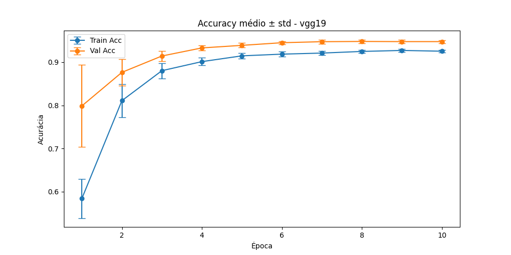
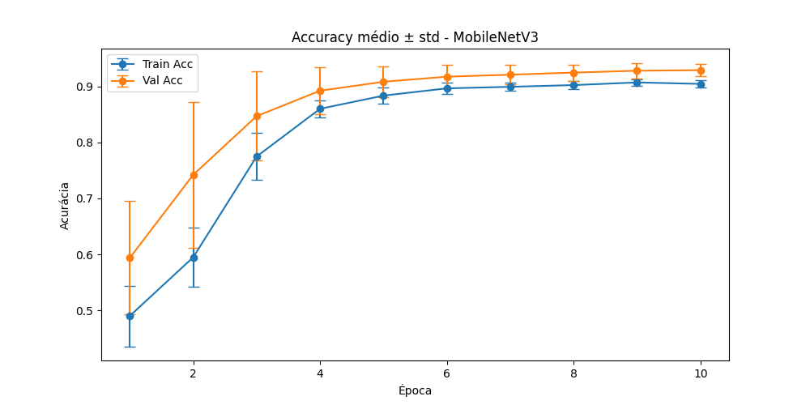

# Deep-Learning-Eye-Classifier

Treinamentos sem pré-processamento

Resultado de uma run com a RESNET50 pré-treinada

```
===== Run 10/10 =====
Epoch 1/10 | Train Loss: 0.6627 Acc: 0.5913 | Val Loss: 0.5837 Acc: 0.7258 | Prec: 0.6000 Rec: 0.9634 F1: 0.7395 ROC_AUC: 0.9553    
Epoch 2/10 | Train Loss: 0.4814 Acc: 0.8361 | Val Loss: 0.2926 Acc: 0.9146 | Prec: 0.8540 Rec: 0.9512 F1: 0.9000 ROC_AUC: 0.9811     
Epoch 3/10 | Train Loss: 0.3200 Acc: 0.9141 | Val Loss: 0.1690 Acc: 0.9655 | Prec: 0.9518 Rec: 0.9634 F1: 0.9576 ROC_AUC: 0.9964     
Epoch 4/10 | Train Loss: 0.2184 Acc: 0.9398 | Val Loss: 0.1243 Acc: 0.9803 | Prec: 0.9680 Rec: 0.9837 F1: 0.9758 ROC_AUC: 0.9987     
Epoch 5/10 | Train Loss: 0.1691 Acc: 0.9556 | Val Loss: 0.1157 Acc: 0.9836 | Prec: 0.9646 Rec: 0.9959 F1: 0.9800 ROC_AUC: 0.9990
Epoch 6/10 | Train Loss: 0.1488 Acc: 0.9551 | Val Loss: 0.0777 Acc: 0.9885 | Prec: 0.9799 Rec: 0.9919 F1: 0.9859 ROC_AUC: 0.9993     
Epoch 7/10 | Train Loss: 0.1436 Acc: 0.9561 | Val Loss: 0.0935 Acc: 0.9803 | Prec: 0.9535 Rec: 1.0000 F1: 0.9762 ROC_AUC: 0.9995     
Epoch 8/10 | Train Loss: 0.1063 Acc: 0.9763 | Val Loss: 0.0785 Acc: 0.9869 | Prec: 0.9685 Rec: 1.0000 F1: 0.9840 ROC_AUC: 0.9994     
Epoch 9/10 | Train Loss: 0.1159 Acc: 0.9689 | Val Loss: 0.0673 Acc: 0.9901 | Prec: 0.9800 Rec: 0.9959 F1: 0.9879 ROC_AUC: 0.9995     
Epoch 10/10 | Train Loss: 0.1057 Acc: 0.9729 | Val Loss: 0.0664 Acc: 0.9901 | Prec: 0.9800 Rec: 0.9959 F1: 0.9879 ROC_AUC: 0.9996
```


Resultado de uma run com a VGG19 pré-treinada

```

```



```

```




# Possível abordagem


                                    ┌───────────────┐
                                    │  Input Image  │
                                    └───────┬───────┘
                                            │
          ┌──────────────────────────────────────────────────────────────────┐
          │                 │                  │                             │              
          ▼                 ▼                  ▼                             ▼
    ┌───────────────┐  ┌───────────────┐  ┌───────────────┐            ┌───────────────┐    
    │  Backbone     │  │  Backbone     │  │  Backbone     │            │   Handcraft   │        
    │  ResNet50     │  │  VGG16        │  │  MobileNet    │            │  extraction   │
    └───────┬───────┘  └───────┬───────┘  └───────┬───────┘            └───────┬───────┘
            │                  │                  │                            │
            ▼                  ▼                  ▼                            │  
    ┌────────────────┐ ┌────────────────┐ ┌────────────────┐                   │
    │ AvgPool +      │ │ AvgPool +      │ │ AvgPool +      │                   │  
    │ Flatten        │ │ Flatten        │ │ Flatten        │                   │  
    └───────┬────────┘ └───────┬────────┘ └───────┬────────┘                   │  
            │                  │                  │                            │  
            ▼                  ▼                  ▼                            │  
    ┌────────────────┐ ┌────────────────┐ ┌────────────────┐           ┌───────────────┐
    │ Interm. Layer  │ │ Interm. Layer  │ │ Interm. Layer  │           │ Feature Fusion│   
    │ 512 → 128      │ │ 1024 → 256     │ │ 256 → 64       │────────── │   Concatenate │
    │ BN + Dropout   │ │ BN + Dropout   │ │ BN + Dropout   │           └───────┬───────┘
    │ ReLU           │ │ ReLU           │ │ ReLU           │                   │ 
    └───────┬────────┘ └───────┬────────┘ └───────┬────────┘                   │ 
            │                  │                  │                            │ 
            ▼                  ▼                  ▼                            ▼ 
    ┌────────────────┐ ┌────────────────┐ ┌────────────────┐           ┌────────────────┐
    │ Classifier     │ │ Classifier     │ │ Classifier     │           │   Classifier   │
    │ (Softmax/FC)   │ │ (Softmax/FC)   │ │ (Softmax/FC)   │           │   (AdaBoost)   │ 
    └────────────────┘ └────────────────┘ └────────────────┘           └────────────────┘


                                                       ┌───────────────┐
                                                       │   Dataset     │
                                                       └───────┬───────┘
                                                               │
                               ┌───────────────────────────────┴──────────────────────────────┐
                               ▼                                                              ▼
                     ┌──────────────────┐                                           ┌──────────────────┐
                     │  Pré-processado  │                                           │Não pré-processado│
                     └─────────┬────────┘                                           └─────────┬────────┘
                               │                                                              │
          ┌────────────────────┼─────────────────┐                       ┌────────────────────┼─────────────────┐                         
          ▼                    ▼                 ▼                       ▼                    ▼                 ▼  
    ┌───────────────┐  ┌───────────────┐  ┌───────────────┐      ┌───────────────┐  ┌───────────────┐  ┌───────────────┐
    │  Backbone     │  │  Backbone     │  │  Backbone     │      │  Backbone     │  │  Backbone     │  │  Backbone     │
    │  ResNet50     │  │  VGG16        │  │  MobileNet    │      │  ResNet50     │  │  VGG16        │  │  MobileNet    │
    └───────┬───────┘  └───────┬───────┘  └───────┬───────┘      └───────┬───────┘  └───────┬───────┘  └───────┬───────┘
            │                  │                  │                      │                  │                  │
            ▼                  ▼                  ▼                      ▼                  ▼                  ▼
    ┌────────────────┐ ┌────────────────┐ ┌────────────────┐     ┌────────────────┐ ┌────────────────┐ ┌────────────────┐
    │ AvgPool +      │ │ AvgPool +      │ │ AvgPool +      │     │ AvgPool +      │ │ AvgPool +      │ │ AvgPool +      │
    │ Flatten        │ │ Flatten        │ │ Flatten        │     │ Flatten        │ │ Flatten        │ │ Flatten        │
    └───────┬────────┘ └───────┬────────┘ └───────┬────────┘     └───────┬────────┘ └───────┬────────┘ └───────┬────────┘
            │                  │                  │                      │                  │                  │
            ▼                  ▼                  ▼                      ▼                  ▼                  ▼
    ┌────────────────┐ ┌────────────────┐ ┌────────────────┐     ┌────────────────┐ ┌────────────────┐ ┌────────────────┐
    │ Interm. Layer  │ │ Interm. Layer  │ │ Interm. Layer  │     │ Interm. Layer  │ │ Interm. Layer  │ │ Interm. Layer  │
    │ BN + Dropout   │ │ BN + Dropout   │ │ BN + Dropout   │     │ BN + Dropout   │ │ BN + Dropout   │ │ BN + Dropout   │
    │ ReLU           │ │ ReLU           │ │ ReLU           │     │ ReLU           │ │ ReLU           │ │ ReLU           │
    └───────┬────────┘ └───────┬────────┘ └───────┬────────┘     └───────┬────────┘ └───────┬────────┘ └───────┬────────┘
            │                  │                  │                      │                  │                  │
            ▼                  ▼                  ▼                      ▼                  ▼                  ▼
    ┌────────────────┐ ┌────────────────┐ ┌────────────────┐     ┌────────────────┐ ┌────────────────┐ ┌────────────────┐
    │ Classifier     │ │ Classifier     │ │ Classifier     │     │ Classifier     │ │ Classifier     │ │ Classifier     │
    │ (Softmax/FC)   │ │ (Softmax/FC)   │ │ (Softmax/FC)   │     │ (Softmax/FC)   │ │ (Softmax/FC)   │ │ (Softmax/FC)   │
    └────────────────┘ └────────────────┘ └────────────────┘     └────────────────┘ └────────────────┘ └────────────────┘
    

